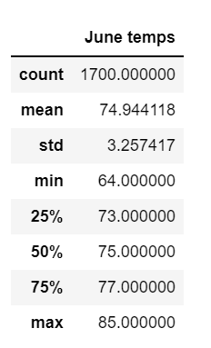
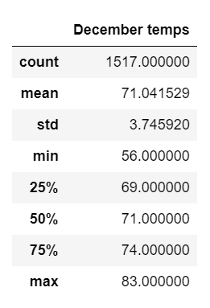

# Surfs Up

## Overview of the analysis
Hawaii weather data is queried and analyzed using SQLAlchemy and Jupyter Notebook on a SQLite database.  The purpose is to make decisions on potential locations for investors of a new surf store in the island of Oahu.

## Results


*June temperature statistics summary.*

*December temperature statistics summary.*

As seen in the June vs. December statistics comparison above, we can see that:
- There is a 4 F average temperature difference between the two months.
- There is more variation in temperatures for the month of December, compared to June.
- There is a more dramatic difference for minimum temperatures than there is for maximum temperatures, between the two months.


## Summary: Provide a high-level summary of the results and two additional queries that you would perform to gather more weather data for June and December.

Differences in temperature between the months of June and December appear to be driven by more frequent drops in temperature for the winter, while the average and maximum temperatures hover around similar values.

It would be helpful to perform a query on the Stations table, to find out which ones are reporting more frequently, and select the top ones. This would help compare how much the results differ for these summary statistics on the two months.

```
session.query(Measurement.station, func.count(Measurement.station)).\
    filter(extract("month", Measurement.date) == 5).\
    group_by(Measurement.station).\
    order_by(func.count(Measurement.station).desc()).all()
```

AND

```
session.query(Measurement.station, func.count(Measurement.station)).\
    filter(extract("month", Measurement.date) == 12).\
    group_by(Measurement.station).\
    order_by(func.count(Measurement.station).desc()).all()
```